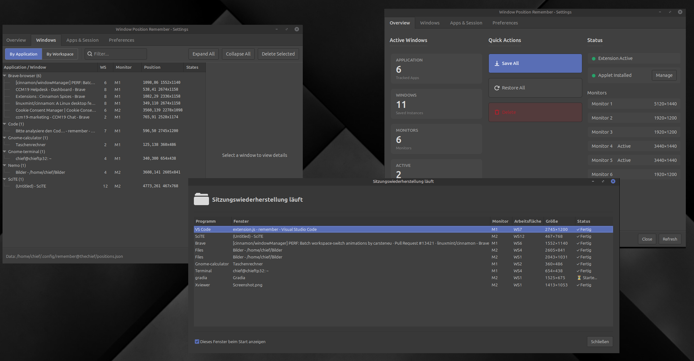

# Window Position Remember

A Cinnamon Desktop extension that automatically saves and restores window positions across sessions and monitors.



## Features

- **Automatic Position Saving** - Window positions are saved every 30 seconds using a dirty-flag system for efficiency
- **Multi-Monitor Support** - Full support for multiple monitors with EDID-based identification that persists even when monitors are reconnected to different ports
- **Session Restore** - Automatically restores your complete workspace layout on login, including launching applications
- **Smart Window Matching** - Intelligent matching algorithm based on stable sequence, X11 window ID, and title matching
- **Resolution-Independent** - Uses percentage-based positioning that automatically adapts to resolution changes
- **Plugin System** - App-specific handlers for browsers, IDEs, office suites, and other applications with special requirements
- **Flatpak Support** - Automatic detection and launching of Flatpak applications
- **GTK Settings UI** - Comprehensive Python/GTK 3 settings dialog with tabs for overview, windows, apps, and preferences
- **Multi-Language Support** - Translations available in 15+ languages

## Supported Applications

The extension works with **all applications** out of the box. Some applications with special requirements (multi-window browsers, IDEs with workspace restoration, document-based apps) have dedicated plugins for optimal handling:

| Application | Features |
|-------------|----------|
| **Brave / Chrome** | Multi-window browser support |
| **Firefox** | Session restore integration |
| **Thunderbird** | Multi-profile support |
| **VS Code** | Workspace restoration |
| **JetBrains IDEs** | IntelliJ, PyCharm, WebStorm, etc. |
| **LibreOffice** | Document path restoration |
| **GIMP** | Image editor with file paths |
| **Gedit / Xed / Kate** | Text editors with file restoration |
| **Nemo** | File manager directory restore |
| **Gradia** | Screenshot tool (Flatpak) |

### Custom Plugins

You can create your own plugins for applications with special requirements. Place them in:

```
~/.config/remember@thechief/plugins/<app-name>/config.json
```

See the built-in plugins for examples of the configuration format.

## Installation

### From Cinnamon Spices (Recommended)

1. Open **System Settings → Extensions**
2. Click the **Download** tab
3. Search for "Window Position Remember"
4. Click **Install**
5. Enable the extension in the **Manage** tab

### Manual Installation

```bash
git clone https://github.com/carsteneu/remember.git
cd remember
./install.sh
```

Then enable the extension in System Settings → Extensions.

## Usage

1. Enable the extension in System Settings → Extensions
2. Arrange your windows as desired
3. Positions are automatically saved every 30 seconds
4. On next login, windows are restored to their saved positions

## Configuration

Right-click the extension in the Extensions list and select **Configure** to open the settings dialog:

### Overview Tab
- View tracked windows and monitors
- Quick statistics and status

### Windows Tab
- View all saved window instances
- Manage individual window entries

### Applications Tab
- **Session Restore**: Enable/disable per-app auto-launch on login
- **Application Blacklist**: Exclude specific applications from tracking
- **Single Instance Apps**: Configure apps that should only launch once

### Preferences Tab
- **Startup Delay**: Time to wait before session restore begins (default: 2s)
- **Per-Window Restore Delay**: Time between each window restore (default: 500ms)

## How It Works

### Window Matching Strategy

The extension uses multiple strategies to reliably identify windows (priority order):

1. **stable_sequence** - Most reliable within session
2. **x11_window_id** - Persists across Cinnamon restarts
3. **Exact title match** - For after re-login when IDs change
4. **First unassigned instance** - Order-based fallback

### Monitor Identification

Monitors are identified using:

1. **EDID hash** - Primary method, extracted via xrandr
2. **Connector + Resolution** - Fallback method
3. **Monitor index** - Last resort

This ensures your layout is restored correctly even when monitors are reconnected in different ports.

### Position Storage

- Positions stored as percentages (adapts to resolution changes)
- Absolute pixel coordinates kept as backup
- Data stored in: `~/.config/remember@thechief/`

## Troubleshooting

### Windows not restoring on startup
- Check if session restore is enabled in Applications tab
- Increase startup delay in Preferences
- Check logs: `tail -f ~/.xsession-errors`

### Application launches multiple times
- Enable "Single Instance" for that app in the Applications tab

### Wrong monitor positions
- Ensure monitors are connected to the same physical ports
- Re-save positions after changing monitor configuration

## Technical Details

- **Cinnamon Version**: 5.0 - 6.4
- **Languages**: JavaScript (Extension), Python 3 (Settings UI)
- **Auto-save Interval**: 30 seconds
- **Config Directory**: `~/.config/remember@thechief/`

## License

GPL-2.0

## Author

[carsteneu](https://github.com/carsteneu)

## Links

- [GitHub Repository](https://github.com/carsteneu/remember)
- [Report Issues](https://github.com/carsteneu/remember/issues)
